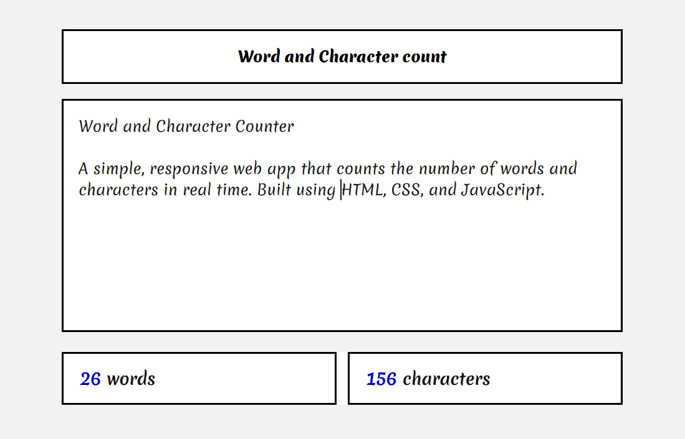

# 📝 Word and Character Counter

A simple, responsive web app that counts the number of words and characters in real time. Built using **HTML**, **CSS**, and **JavaScript**.

 

## 🔗 Live Demo

🌐 [View Live Demo](https://paulmagadi.github.io/word-character-counter)  

---

## ✨ Features

- 🔢 Real-time word and character counting
- 📱 Mobile-friendly and responsive design
- 🖋️ Custom Google Fonts for styling
- 🧹 Ignores extra whitespace for accurate word count

---

## 🚀 Getting Started

### 1. Clone the Repository

```bash
git clone https://github.com/yourusername/word-character-counter.git
cd word-character-counter
```

2. Open Locally
You can open `index.html `directly in your browser, or use a local server:

## 📁 Project Structure

```
word-character-counter/
├── index.html          # Main webpage
├── styles.css          # Styling for the interface
├── scripts.js          # JavaScript logic for live counting
└── README.md           # Project documentation
```

## 🧠 How It Works
Listens for input events on the textarea

- Character count is simply the `.length` of the input

- Word count uses `.trim().split(/\s+/)` to ensure multiple spaces are ignored

## 🛠️ Built With
1. HTML5

2. CSS3

3. JavaScript (Vanilla)

## Future Enhancements
- ✅ Dark mode toggle

- ✅ Save input to file

- ✅ Add paste/upload text support

- ✅ Grammar/spell check integration

## 📄 License
This project is free to use under the MIT License.

## 🙋‍♂️ Author
**Paul Magadi**

A simple project to practice JavaScript DOM manipulation and UI design. Feel free to contribute!